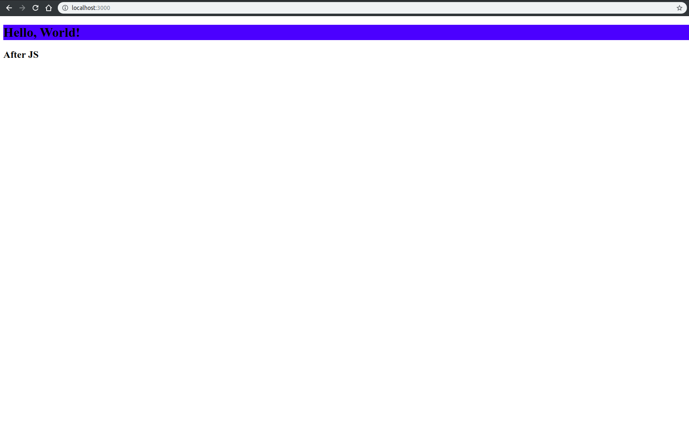
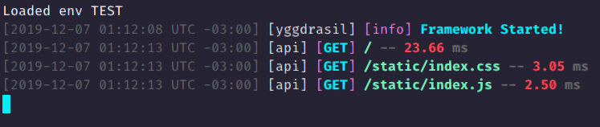

<h1 align="center">
	</img>
</h1>

<h2 align="center">
	Yggdrasil
</h1>
<h3 align="center">
	A lightweight modern JS microsservice framework
</h3>

</hr>

## Getting Started

### Create your first MVC
- **.env**
  ```dotenv
  # Framework Configuration
	# IANA Timezone
	TZ= "America/Recife"

	# Log Configuration
	LOG_ENABLE_OUTPUT=false
	LOG_OUTPUT_FOLDER=./logs
	LOG_OUTPUT_MAXFILES=10
	LOG_OUTPUT_LOGSIZE=10 #In MegaBytes

  ```
- **index.js**
	```javascript
	// Require Framework
	const {
		Yggdrasil,
		modules: {APIs,Controllers}
	} = require("yggdrasil")

	// Instance Yggdrasil Core
	const ygg = new Yggdrasil();

	// Add Controllers Module
	ygg.use(new Controllers({
		controllersDir: "./src/controllers"
	}))

	// Add the API Module
	ygg.use(new APIs({
		// Recieve a list of API's to Implement
		apiModelList: [ 
			{
				// Internal name of the api
				name: "api", 
				// Route to an file or directory of API routes
				routesDirPath: "./src/routes", 
				// Set the type of the API
				type: APIs.apiTypes.HTTP,
				// Set the port to listen
				port: 3000,
				// In HTTP API - Set an static folder files (under /static route)
				staticDirPath: "./www/static",
				// In HTTP API - Set an folder for Handlerbars Views
				viewsDirPath: "./www/views"
			}
		]
	}))

	// Start the Application
	ygg.start().then(() => ygg.info("Framework Started!"))
	```

- **src/controllers/apiHandler.js**
	```javascript
	const {classes: {Controller}} = require("yggdrasil");

	class APIHandler extends Controller {
		async onInit() {
			// Here yggApp doesn't has consistency
			// Use to create queues and create connections
			// You can provide new objects to yggApp here
		}

		async onReady() {
			// yggApp can now be used
			// you can call function of others controllers or 
			// call functions of this controllers to execute on
			// framework start
			this.yggApp.customProp = {blob: 42}
		}

		routeIndex(req,res) {
			// Reply an render of a view using handlebars
			res.view("index.handlebars", {data: "Hello, World!"});
		}
	}

	module.exports = APIHandler
	```
- **src/routes/routes.js**
  ```javascript
  module.exports = 
	// This is a list of routes
	[
		// This is a route
		{
			// Route (URI) to listen
			"route": "/", 
			// List of Methods to Apply on this route
			"methods": [
				{
					// HTTP Type of method
					"type": "GET",
					// Controller to handle (Use file name without .js)
					"controller": "apiHandler",
					// Method of Controller to handle request
					"handler": "routeIndex"
				}
			]
		}
	]
  ```
- **Final folder structure**

	At end we'll have something like this
  	```
	•
	├── src
	│   ├── controllers
	│   │   └── apiHandler.js
	│   └── routes
	│       └── routes.js
	├── index.js
	├── .env
	└── www
		├── static
		│   ├── index.js
		│   └── index.css
		└── views
			└── index.handlebars
  	```

	Let's execute it! Let's try the " / " route : 
	
	

	Got It! Now, lets see the logs :

	


	It's it, you successfully created your first application with Yggdrasil !